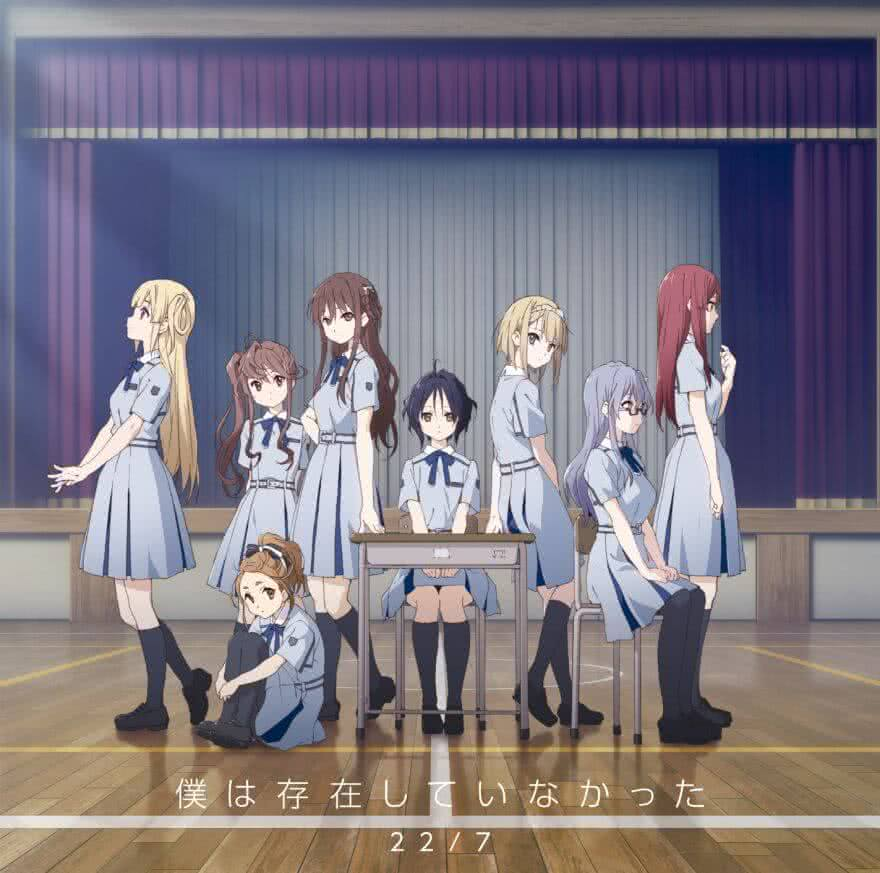

Lirik lagu **Juuichinin ga Atsumatta Riyuu** oleh **22/7** (_Nanabun no Nijyuuni_) terjemahan Bahasa Indonesia. _Juuichinin ga Atsumatta Riyuu_ adalah lagu coupling single pertama Nanabun no Nijyuuni (Boku wa Sonzai Shiteinakatta). Lagu ini merupakan lagu 22/7 pertama yang dinyanyikan oleh kesebelas member. Berikut terjemahan lirik dalam **Bahasa Indonesia**, beserta lirik aslinya dalam Kanji maupun Romaji.

 

- Judul : **11 人が集まった理由** (_Juuichinin ga Atsumatta Riyuu_ / Alasan Sebelas dari Kita Bersama)
- Artist : 22/7 (_Nanabun no Nijyuuni_)
- Single : 1st Single - 僕は存在していなかった (_Boku wa Sonzai Shiteinakatta_ / Meskipun Keberadaanku Tak Ada)
- Realese Date : _2017.09.20_

## Bahasa Indonesia

Sejak kapan kita sudah bersama? 
Awalnya kita semua tak saling mengenal 
Dengan canggungnya selalu melihat kebawah 
Mungkin kita ini hanya sekumpulan pemalu 

Sejak kapan kita sudah bersama? 
Bukan karena orang dewasa yang menyuruh kita 
Tetapi untuk pertama kalinya 
Kita berani untuk membuka diri ke dunia yang luas 

Jadi, mulai sekarang apa yang harus kita lakukan? 
11 dari kita merasa bisa melakukan apapun 

Dengan memahami mimpi kita 
Kita pun tersenyum 

Sejak kapan kita sudah bersama? 
Kita sama-sama tidak menyukai keramaian 
Namun terlepas dari itu, bersama kalian 
Entah bagaimana membuatku bahagia 

Jadi, mulai sekarang kemana kita harus pergi? 
Hati pendiam kita berteriak 
Berdiri berdampingan dan berpegangan tangan 
11 dari kita merasa bisa pergi kemanapun 

Menuju esok hari 
Kita mengambil langkah kedepan 

Jadi, mulai sekarang kemana kita harus pergi? 
Sampai saat ini, kita terus hidup sendirian, tapi 
Kita semua disatukan oleh takdir ini 
Hari dimana 11 dari kita mulai mengerti alasannya 

Mimpi itu selalu 
Tepat di depan mata kita 

Akhirnya, kita bisa bertemu 
Kita mengambil langkah kedepan 

## Kanji

いつのまに　集まったんだ？ 
会ったことない誰かたち 
ぎこちなく俯(うつむ)いている 
人見知り同士だね 

いつのまに　集まったんだ？ 
大人に言われたわけじゃない 
初めて自分から開けた 
外に広がる世界 

さあこれから　何をしようか？ 
何でもできる気がする 11 人 

夢を見ながら 
僕らは微笑んだ 

いつのまに　集まったんだ？ 
誰かといるのは嫌だった 
それでもみんなといるのが 
なぜか幸せに思う 

さあこれから　どこへ行こう？ 
無口な心が叫んでいるよ 
横に並び手を繋いだら 
どこへも行ける気がした 11 人 

明日(あす)に向かって 
僕らは歩き出す 

さあこれから　どこへ行こう？ 
今日まで一人で生きて来たけど 
この運命に引き寄せられた 
理由がわかる日が来る 11 人 

夢はいつでも 
僕らの前にある 

やっと出会えた 
僕らは歩き出す 

## Romaji

Itsunomani atsumatta nda? 
atta koto nai dareka tachi 
gikochinaku utsumu ite iru 
hitomishiri doushi da ne 

itsunomani atsumatta nda? 
otona ni iwareta wake janai 
hajimete jibun kara aketa 
soto ni hirogaru sekai 

saa korekara nani o shiyou ka? 
nandemo dekiru ki ga suru juuichi nin 

yume o minagara 
bokura wa hohoenda 

itsunomani atsumatta nda? 
dareka to iru no wa iya datta 
soredemo minna to iru no ga 
naze ka shiawase ni omou 

saa korekara doko e ikou? 
mukuchi na kokoro ga sakende iru yo 
yoko ni narabi te o tsunaidara 
doko e mo ikeru ki ga shita juuichi nin 

asu ni mukatte 
bokura wa arukidasu 

saa korekara doko e ikou? 
kyou made hitori de ikite kita kedo 
kono unmei ni hikiyoserareta 
riyuu ga wakaru hi ga kuru juuichi nin 

yume wa itsudemo 
bokura no mae ni aru 

yatto deaeta 
bokura wa arukidasu 
