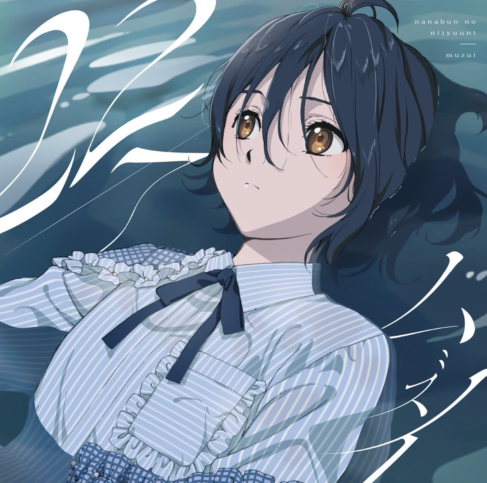

Lirik lagu **Muzui** oleh **22/7** (_Nanabun no Nijyuuni_) terjemahan Bahasa Indonesia. _Muzui_ adalah lagu utama single ke-5 Nanabun no Nijyuuni (Muzui). Lagu ini menjadi opening theme anime 22/7 yang tayang 11 Januari 2020. Berikut terjemahan lirik dalam **Bahasa Indonesia**, beserta lirik aslinya dalam Kanji maupun Romaji.

	

- Judul : **ムズイ** (_Muzui_ / Sulit)
- Oleh : (_Real name / Character_)
  - Nagomi Saijo / Miu Takigawa
  - Sally Amaki / Sakura Fujima
    - Mizuha Kuraoka / Miyako Kono
    - Chiharu Hokaze / Reika Sato
    - Ruri Umino / Jun Toda
    - Kanae Shirosawa / Akane Maruyama
    - Reina Miyase / Ayaka Tachikawa
    - Uta Kawase / Nicole Saito (new)
- Artist : 22/7 (_Nanabun no Nijyuuni_)
- Single : 5th Single - ムズイ (_Muzui_ / Sulit)
- Realese Date : _2020.02.26_

## Bahasa Indonesia

"Orang dewasa dengan mudah mengatakannya... 
Harapan untuk diriku, dimanakah ia berada?" 

Di dalam arus lalu lintas yang ramai 
Aku tak dapat menyeberangi jalan 
Kata-kata seseorang dengan tatapannya yang dingin 
Membuat hati ku mengerut seketika 

Dengan memiliki mimpi 
Hanya akan berakhir dengan membuatku terluka 

"Aku tak tahu dimana diriku sekarang berada" 
Di dunia yang semuanya tak terlihat diriku tersesat 
"Kemanakah aku harus pergi melangkah?" 
"Aku tak mau berjalan kemanapun lagi" 

Hei, beri tahu aku (siapa pun) kenapa kita harus tetap hidup? (beri tahu aku) 
Apakah dalam kehidupan (hidup) ini ada suatu tujuan? 
Aku tak percaya diri (diriku), apa yang harus kulakukan selanjutnya? (melangkahlah!) 
Karena hidup ku itu terlalu panjang 
"Hidup itu sulit" 

Tirai jendela kelas yang terhembus angin 
Sudah berapa kali mengembang dan menyusut 
Pelajaran yang membosankan maupun juga teman sekelas 
Keduanya tak membuatku tertarik 

Cara melarikan diri dari keseharian 
Hanya terdapat satu cara saja 

"Tak usah menggunakan kata-kata yang lembut 
Karena mimpiku pasti juga tak akan menjadi nyata 
Katakan dengan jelas 
Bahwa semuanya adalah ilusi" 

Hei, beri tahu aku (siapa pun) kenapa tidak memilih mati saja? (beri tahu aku) 
Pasti semua orang (semua orang) pernah memikirkannya, kan? 
Aku pun (pasti) tak boleh terus seperti ini (selamat tinggal) 
Apa yang harus ku yakini dalam hidup ini 

Diriku yang ingin ku raih dan diriku yang gagal ku raih 
Juga diriku yang menangis di depan cermin, semua adalah diriku 

Meski semua orang dapat berubah 
Jangan pernah perlihatkan mimpimu 
"Menyerah itu lebih mudah... maafkan aku" 

Hei, beri tahu aku (siapa pun) kenapa kita harus tetap hidup? (beri tahu aku) 
Apakah dalam kehidupan (hidup) ini ada suatu tujuan? 
Aku tak percaya diri (diriku), apa yang harus kulakukan selanjutnya? (melangkahlah!) 
Karena hidup ku itu terlalu panjang 
"Hidup itu sulit" 

## Kanji

「大人たちは簡単に言うけど… 
私にとっての希望って　どこにあるの？」 

途切れることのない車の往来に 
国道　渡れなかった 
誰かの言葉とか　冷たい眼差しに 
心が萎縮するように… 

夢なんかを見ていたって 
傷つくだけだと身にしみた 

「自分がどこにいるのかわからない　何も見えない世界で途方に暮れている 
どっちに向かって進めばいいの？もうどこへも歩きたくない」 

ねえどうして　(人は)　生きていかなきゃいけないの？　(教えて) 
命って　(命って)　何のためにあるの？ 
自信がない　(私)　これからどう生きればいい？　(孤独よ) 
だって人生が長すぎる 
「ムズイよ」 

教室のカーテン　漏らしたため息に 
何度も膨らみ萎(しぼ)む 
つまらない授業もただのクラスメイトも 
何にも興味が持てない 

日常から逃げ出すには 
一つしか方法がなかった 

「優しい言葉なんか掛けないで　叶わない夢ばかり見てしまうから 
はっきり言って欲しい　すべては幻想なんだと」 

ねえどうして(人は)　死にたくなっちゃいけないの？　(教えて) 
誰だって　(誰だって)　考えるでしょう？ 
私なんて　(きっと)　このままいなくなればいい　(さよなら) 
何を信じて生きるのだろう 

なりたかった自分も　なれなかった自分も 
窓ガラスに映った泣いている自分も　全部自分だ 

人は誰でも変われるって 
夢なんか見せないでよ 
「諦めた方が楽だし…ごめん」 

ねえどうして　(人は)　生きていかなきゃいけないの？　(教えて) 
命って　(命って)　何のためにあるの？ 
自信がない　(私)　これからどう生きればいい？　(孤独よ) 
だって人生が長すぎる 
「ムズイよ」 

## Romaji

“otonatachi wa kantan ni iu kedo… 
watashi ni totte no kibou tte doko ni aru no?” 

togireru koto no nai kuruma no oorai ni 
kokudou watarenakatta 
dareka no kotoba to ka tsumetai manazashi ni 
kokoro ga ishuku suru you ni… 

yume nanka wo miteitatte 
kizutsuku dake da to mi ni shimita 

“jibun ga doko ni iru no ka wakaranai nanimo mienai sekai de tohou ni kureteiru 
docchi ni mukatte susumeba ii no? mou doko e mo arukitakunai” 

nee doushite (hito wa) ikite ikanakya ikenai no? (oshiete) 
inochi tte (inochi tte) nan no tame ni aru no? 
jishin ga nai (watashi) kore kara dou ikireba ii? (kodoku yo) 
datte jinsei ga nagasugiru 
“muzui yo” 

kyoushitsu no kaaten morashita tameiki ni 
nando mo fukurami shibomu 
tsumaranai jugyou mo tada no kurasumeito mo 
nannimo kyoumi ga motenai 

nichijou kara nigedasu ni wa 
hitotsu shika houhou ga nakatta 

“yasashii kotoba nanka kakenaide kanawanai yume bakari mite shimau kara 
hakkiri itte hoshii subete wa gensou nan da to” 

nee doushite (hito wa) shinitakunaccha ikenai no? (oshiete) 
dare datte (dare datte) kangaeru deshou? 
watashi nante (kitto) kono mama inakunareba ii (sayonara) 
nani wo shinjite ikiru no darou 

naritakatta jibun mo narenakatta jibun mo 
mado garasu ni utsutta naiteiru jibun mo zenbu jibun da 

hito wa dare demo kawareru tte 
yume nanka misenaide yo 
“akirameta hou ga raku da shi… gomen” 

nee doushite (hito wa) ikite ikanakya ikenai no? (oshiete) 
inochi tte (inochi tte) nan no tame ni aru no? 
jishin ga nai (watashi) kore kara dou ikireba ii? (kodoku yo) 
datte jinsei ga nagasugiru 
“muzui yo” 
