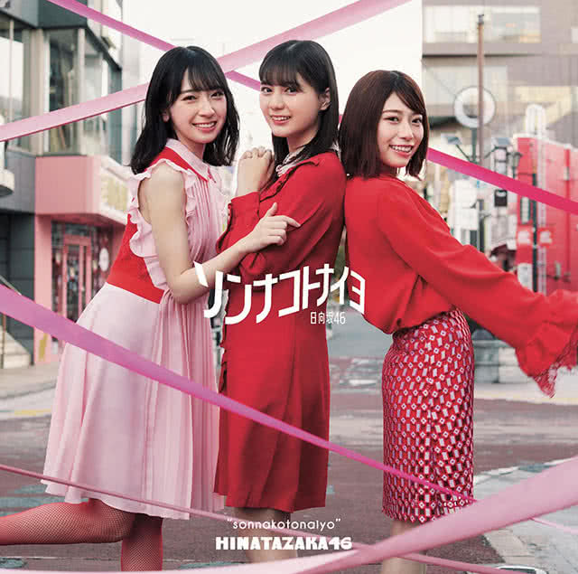

Lirik lagu **Sonna Koto Nai yo** oleh **Hinatazaka46** terjemahan Bahasa Indonesia. _Sonna Koto Nai yo_ adalah lagu utama single ke-4 Hinatazaka46 (Sonna Koto Nai yo). Berikut terjemahan lirik dalam **Bahasa Indonesia**, beserta lirik aslinya dalam Kanji maupun Romaji.

	

- Judul : **ソンナコトナイヨ** (_Sonna Koto Nai yo_ / Itu Tidak Benar)
- Oleh :
  - 1st Generation : Ushio Sarina, Kato Shiho, Saito Kyoko, Sasaki Kumi, Sasaki Mirei, Takase Mana, Takamoto Ayaka, Higashimura Mei
  - 2nd Generation : Kanemura Miku, Kawata Hina, Kosaka Nao, Tomita Suzuka, Nibu Akari, Hamagishi Hiyori, Matsuda Konoka, Miyata Manamo, Watanabe Miho
  - 3rd Generation : Kamimura Hinano
- Artist : 日向坂 46 (_Hinatazaka46_)
- Single : 4th Single - ソンナコトナイヨ (_Sonna Koto Nai yo_ / Itu Tidak Benar)
- Realese Date : _2020.02.19_

## Bahasa Indonesia

Angin musim semi tiba-tiba berhembus 
Menyingkap lembut tirai jendela 
Seolah-olah kau sedang tidak sehat 
Terlihat dari pipimu 

Bekas rambut poni yang kau potong masih tampak 
Seseorang mengatakan kepadaku kenapa kau tampak sedih 

Itu tidak benar, aku tidak berpikir demikian 
Bagaimanapun dirimu, aku tetap menyukaimu 
Itu tidak benar, aku ingin memelukmu 
Kau adalah orang paling cantik di kelas 
Lihatlah dirimu di cermin dengan baik, bukankah sangat cocok 
Bukankah gadis dipantulannya tampak sangat menawan 

Itu tidak benar! 

Sinar matahari dan bayangannya 
Membentuk petak cahaya di lantai kelas 
Berubah pola setiap satu detik 
Perasaan khas remaja 

Aku tahu aku seperti anak kecil 
Ibuku memberitahu, pasti rambutku akan tumbuh panjang lagi 

Jangan khawatir, aku tidak membencinya 
Dimana hal yang tidak kau suka 
Jangan khawatir, kau selalu tampak menyilaukan 
Aku sadar diriku menyukai orang terbaik di dunia 
Ada banyak gadis cantik lain, tetapi aku tidak ingin selain dirimu 
Lihatlah gadis yang ada di pantulan cermin itu dengan baik 

Aku sudah lama menyukaimu 
Apapun yang kau lakukan, takkan merubahnya 

Itu tidak benar, aku tidak berpikir demikian 
Bagaimanapun dirimu, aku tetap menyukaimu 
Itu tidak benar, aku ingin memelukmu 
Kau adalah orang paling cantik di kelas 
Lihatlah dirimu di cermin dengan baik, bukankah sangat cocok 
Bukankah gadis dipantulannya tampak sangat menawan 

Jika di suatu tempat ada tipe sepertimu 
Aku takkan menyukaimu seperti ini 
Ya, hanya dirimu saja, bukan orang lain 
Jika di suatu tempat ada tipe sepertimu 
Aku takkan menyukaimu seperti ini 
Aku sangat mencintaimu karena kamu adalah dirimu 

## Kanji

春の風が　不意に吹いて 
窓のカーテンを膨らませた 
まるで君が　拗ねた時の 
ほっぺたみたいに 

切りすぎた前髪　奈良美智の絵だ 
誰かに言われて　どうして落ち込んでるのかな 

ソンナコトナイヨ　僕はそう思わない 
どんな君だって　ときめいてしまうよ 
ソンナコトナイヨ　ハグしたくなるほど 
クラスで１番　君が可愛いよ 
ちゃんと鏡で自分見てごらん　本当似合ってるじゃないか 
あの絵の女の子だって　チャーミングだろ 

ソンナコトナイヨ！ 

さっきまでの　日差しと影 
教室の床は光の地図 
1 秒ごとに　変わって行くよ 
思春期の気持ち 

分かってはいたけど　子供っぽいよね 
ママにも言われた　そのうちまたすぐ伸びてくるでしょ 

気になんてするな　僕は嫌いじゃない 
どこが嫌なの　似合っているのに 
気になんてするな　いつだって眩しい 
世界で１番好きだと気付いた 
他に綺麗な人はいるけど　僕は君でなきゃ嫌だ 
あの絵の女の子のように　目が離せない 

こんな好きなんだ　いつからかハマってた 
どんな君だって　ガッカリなんかしない 

ソンナコトナイヨ　僕はそう思わない 
どんな君だって　ときめいてしまうよ 
ソンナコトナイヨ　ハグしたくなるほど 
クラスで１番　君が可愛いよ 
ちゃんと鏡で自分見てごらん　本当似合ってるじゃないか 
あの絵の女の子だって　チャーミングだろ 

どこにでもいるようなタイプなら 
こんなに好きにはなれないよ 
そう他にいないから君しかダメなんだ 
どこにでもいるようなタイプなら 
こんなに好きにはなれないよ 
君だから君だからこんなに好きなんだ 

## Romaji

Haru no kaze ga fui ni fui te 
Mado no kaaten wo fukurama seta 
Marude kimi ga suneta toki no 
Hoppeta mitai ni 

Kiri sugita maegami narayoshitomo no eda 
Dareka ni iwa rete doushite ochikon deru no ka na 

Sonna koto nai yo boku wa sou omowanai 
Donna kimi datte tokimeite shimau yo 
Sonna koto nai yo hagu shitaku naru hodo 
Kurasu de ichiban kimi ga kawaii yo 
Chanto kagami de jibun mite goran hontouni atteru janai ka 
Ano e no onnanoko datte chaamingudaro 

Sonna koto nai yo! 

Sakki made no hizashi to kage 
Kyoushitsu no yuka wa hikari no chizu 
Ichibyou goto ni kawatte iku yo 
Shishunki no kimochi 

Wakatte wa itakedo kodomoppoi yo ne 
Mama ni mo iwa reta sono ochi mata sugu nobite kurudesho 

Ki ni nante suru na boku wa kiraijanai 
Doko ga iyana no niatte irunoni 
Ki ni nante suru na itsu datte mabushii 
Sekai de ichiban sukida to kidzuita 

Hoka ni kireina hito wa irukedo boku wa kimidenakya iyada 
Ano e no onnanoko no you ni megahanasenai 

Konna sukina nda itsu kara ka hamatteta 
Donna kimi datte gakkari nanka shinai 

Sonna koto nai yo boku wa sou omowanai 
Donna kimi datte tokimeite shimau yo 
Sonna koto nai yo hagu shitaku naru hodo 
Kurasu de ichiban kimi ga kawaii yo 
Chanto kagami de jibun mite goran hontou niatteru janai ka 
Ano e no onnanoko datte chaamingudaro 

Doko ni demo iru youna taipunara 
Konnani suki ni hanarenai yo 
Sou hoka ni inaikara kimi shika damena nda 
Doko ni demo iru youna taipunara 
Konnani suki ni hanarenai yo 
Kimi dakara kimi dakara konnani sukina nda 
