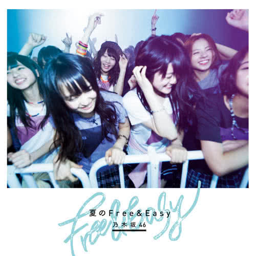

Lirik lagu **Koko ni Iru Riyuu** oleh **Nogizaka46** terjemahan Bahasa Indonesia. *Koko ni Iru Riyuu* adalah lagu coupling single ke-9 Nogizaka46 (Natsu no Free & Easy) yang dibawakan oleh Under Members. Lagu ini juga masuk ke dalam track album ke-4 Nogizaka46 (Boku Dake no Kimi ~Under Super Best~). Berikut terjemahan lirik dalam **Bahasa Indonesia**, beserta lirik aslinya dalam Kanji maupun Romaji.

	

- Judul : **ここにいる理由** (*Koko ni Iru Riyuu* / Alasan Untuk Berada Disini)
- Oleh : Under Members
	- 1st Generation : Ichiki Rena, Ito Nene, Ito Marika, Kawago Hina, Kawamura Mahiro, Saito Asuka, Saito Chiharu, Nagashima Seira, Nakada Kana, Nakamoto Himeka, Noujou Ami, Hatanaka Seira, Higuchi Hina, Wada Maaya
	- 2nd Generation : Kitano Hinako, Shinuchi Mai
- Artist : 乃木坂46 (*Nogizaka46*)
- Single : 9th Single - 夏のFree&Easy (*Natsu no Free & Easy*)
- Album  : 4th Album - 僕だけの君～Under Super Best～ (*Boku Dake no Kimi ~Under Super Best~*)
- Realese Date :
	- Single : *2014.07.09*
	- Album  : *2018.01.10*

### Bahasa Indonesia
Tutup pipa drainase 
Yang sedikit terbuka 
Dan hujan yang belum akan mereda 
Menghanyutkan seluruh waktu kita yang terbuang 
 
Aku menutup perasaanku padamu 
Kau hanya duduk dan menatapku 
Aku tidak peduli apapun itu 
Apapun yang kau katakan akan membuatnya lebih baik 
 
Apakah kita akan tetap seperti ini selamanya? 
Kita berdua duduk disini, tak bergerak? 
Cinta ini hanyalah delusi 
Kita tidak punya alasan lagi untuk bersama 
Kita berdua mengetauinya, dan masih saja... 
 
Air hujan mengalir di dalam pipa 
Membuat suara layaknya kesedihan 
Bahkan hari dimana kita saling mencintai 
Berada di dalam gelapnya dasar ingatanku 
 
Jika aku memegang erat dirimu 
Kita hanya akan mengulangi kesalahan yang sama 
Dan kita akan lebih tersakiti 
Berikan aku kekuatan untuk meninggalkanmu 
 
Sampai kapan aku harus menunggu 
Sampai kau mengerti tidak ada yang dapat kau lakukan dan menyerah? 
"Perpisahan" menjadi sebuah kesempatan 
Tidak ada lagi alasan untuk kita berciuman 
Meskipun aku sudah mengetahuinya sejak lama 
 
Kita akan terkena hipotermia 
 
Apakah kita akan tetap seperti ini selamanya? 
Kita berdua duduk disini, tak bergerak? 
Cinta ini hanyalah delusi 
Kita tidak punya alasan lagi untuk bersama 
Kita berdua mengetauinya, dan masih saja... 
 

### Kanji
排水溝の蓋(ふた)が 
少しだけずれていた 
まだ止まないその雨が 
無駄な時間　押し流すよ 
 
君は感情殺して 
僕を見つめてじっとしてる 
どんな言葉でもいいから 
口に出せば楽になれる 
 
永遠にこうしてるのか？ 
このまま2人は動けないのか？ 
愛なんて錯覚なんだ 
これ以上　ここにいる理由はない 
お互い　わかってるのに… 
 
下水道に落ちてく 
悲しみの音がする 
愛し合った日々さえも 
暗く深い記憶の底 
 
君を抱いてしまったら 
同じ過ち　繰り返すよ 
もっと傷つけてしまう 
突き放せる勇気をくれ 
 
どれくらい待てばいいのか？ 
どうしようもないとあきらめるまで 
サヨナラはきっかけなんだ 
もう一度　キスをする理由はない 
さっきからわかっていても… 
 
低体温になる 
 
永遠にこうしてるのか？ 
このまま2人は動けないのか？ 
愛なんて錯覚なんだ 
これ以上　ここにいる理由はない 
お互い　わかってるのに… 
 

### Romaji
haisuikou no futa ga 
ukoshi dake zurete ita 
mada yamanai sono ame ga 
muda na jikan oshinagasu yo 
 
kimi wa kanjou koroshite 
boku wo mitsumete jitto shiteru 
donna kotoba demo ii kara 
kuchi ni daseba raku ni nareru 
 
eien ni kou shiteru no ka? 
kono mama futari wa ugokenai no ka? 
ai nante sakkaku nanda 
kore ijou koko ni iru riyuu wa nai 
otagai wakatteru no ni... 
 
gesuidou ni ochiteku 
kanashimi no oto ga suru 
ai shiatta hibi sae mo 
kuraku fukai kioku no soko 
 
kimi wo daite shimattara 
onaji ayamachi kurikaesu yo 
motto kizutsukete shimau 
tsukihanaseru yuuki wo kure 
 
dore kurai mateba ii no ka? 
dou shiyou mo nai to akirameru made 
SAYONARA wa kikkake nanda 
mou ichido KISU wo suru riyuu wa nai 
sakki kara wakatte ite mo... 
 
teitaion ni naru 
 
eien ni kou shiteru no ka? 
kono mama futari wa ugokenai no ka? 
ai nante sakkaku nanda 
kore ijou koko ni iru riyuu wa nai 
otagai wakatteru no ni... 
 
